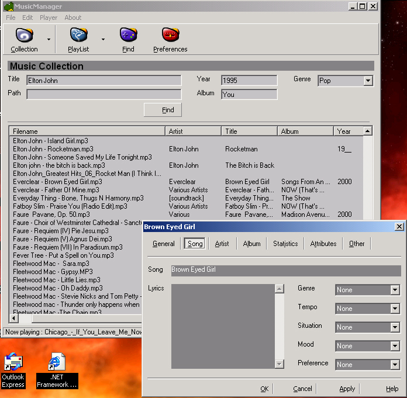



## Rex \- MusicManager

### Description

Simply the biggest and best mp3 / media player with source code on the web. Recurisive search on the disk, reads / writes m3u files, retrieves tags, CDDB support, powerful find feature, Save custom playlists, Parameters on startup, song properties with more than 60 tags, soon a CD Write support. This program is always under construction so please check it out...
 
### More Info
 
Try to launch musicmanager with a parameter like D/C:\music and see what happens.

To read a directory structure, press the collection button and then ADD Drive. Select a folder from the browseforfolders window and let musicmanager do the rest.

I know of no side effects, but if you find any, please mail them to me at webmaster@svenni.com To run this program you need VB6 and SP3. Thanx, MrHippo

             |
---                |---
**Submitted On**   |2000-11-21 09:52:50
**By**             |[N/A](https://github.com/Planet-Source-Code/PSCIndex/blob/master/ByAuthor/empty.md)
**Level**          |Advanced
**User Rating**    |3.6 (29 globes from 8 users)
**Compatibility**  |VB 6\.0
**Category**       |[Sound/MP3](https://github.com/Planet-Source-Code/PSCIndex/blob/master/ByCategory/sound-mp3__1-45.md)
**World**          |[Visual Basic](https://github.com/Planet-Source-Code/PSCIndex/blob/master/ByWorld/visual-basic.md)
**Archive File**   |[CODE\_UPLOAD1200011242000\.zip](https://github.com/Planet-Source-Code/rex-musicmanager__1-13070/archive/master.zip)

### API Declarations

There are many great API calles used in MusicManager. I have commented their use wery well so you may learn a trick or two.

